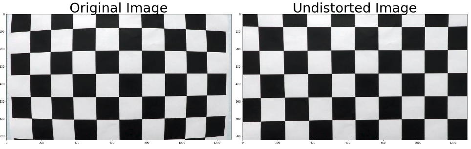

## Project Writeup (Advanced Lane Finding Project)

**Advanced Lane Finding Project**

The goals / steps of this project are the following:

* Compute the camera calibration matrix and distortion coefficients given a set of chessboard images.
* Apply a distortion correction to raw images.
* Use color transforms, gradients, etc., to create a thresholded binary image.
* Apply a perspective transform to rectify binary image ("birds-eye view").
* Detect lane pixels and fit to find the lane boundary.
* Determine the curvature of the lane and vehicle position with respect to center.
* Warp the detected lane boundaries back onto the original image.
* Output visual display of the lane boundaries and numerical estimation of lane curvature and vehicle position.


### Camera Calibration

#### 1. Compute the camera matrix and distortion coefficients. 

The code for this step is contained in the first and second code cell of the IPython notebook located in "advanced-lane-lines.ipynb".  

I start by preparing "object points", which will be the (x, y, z) coordinates of the chessboard corners in the world. Here I am assuming the chessboard is fixed on the (x, y) plane at z=0, such that the object points are the same for each calibration image.  Thus, `objp` is just a replicated array of coordinates, and `objpoints` will be appended with a copy of it every time I successfully detect all chessboard corners in a test image.  `imgpoints` will be appended with the (x, y) pixel position of each of the corners in the image plane with each successful chessboard detection.  

I then used the output `objpoints` and `imgpoints` to compute the camera calibration and distortion coefficients using the `cv2.calibrateCamera()` function.  I applied this distortion correction to the test image using the `cv2.undistort()` function and obtained this result: 



### Pipeline (single images)

#### 1. Undistort a test road image.

After camera calibration, I stored distortion and intrinsic matrix of the camera, so that I can apply the same matrices on images from the same camera len by using  `cv2.undistort()`. This is the result of undistortion on one of the test image:


#### 2. Used color transforms, gradients or other methods to create a thresholded binary image.

I used a combination of color and gradient thresholds to generate a binary image (thresholding steps at the `cal_binary` function at 4th code cell in `advanced-lane-lines.ipynb`).  Here's an example of my output for this step. Color binary is the visualization of how the binary is created. 

- Green color pixels are thresholded S channel from HLS color space. (170 - 255) 
- Blue color pixels are thresholded gradient of L channel from HLS color space. (20 - 100)


#### 3. Used perspective transform to get a birds-eye view of the binary road image.

To better analyze the lane lines, I transform the perspective into a birds-eye view image. The code for my perspective transform includes a function called `transform()` which appears in 6th code cell in `advanced-lane-lines.ipynb`. (output_images/examples/example.py) (or, for example, in the 3rd code cell of the IPython notebook).  The `warper()` function takes as inputs an image (`img`), as well as source (`src`) and destination (`dst`) points.  I chose the source and destination points in the following manner:

```python
src = np.array([[xsize/2 - 55,ysize*0.63],
                [xsize/2 + 55,ysize*0.63],
                [xsize-150,ysize],
                [200,ysize]], dtype=np.float32)

dst = np.array([[xsize/5,0],
                [xsize-xsize/5,0],
                [xsize-xsize/5,ysize],
                [xsize/5,ysize]], dtype=np.float32)
```

This resulted in the following source and destination points:

|  Source   | Destination |
| :-------: | :---------: |
| 585, 454  |   256, 0    |
| 695, 454  |   1024, 0   |
| 1130, 720 |  1024, 720  |
| 200, 720  |  256, 720   |

I verified that my perspective transform was working as expected by drawing the `src` and `dst` points onto a test image which contains straight lanes and its warped counterpart to verify that the lines appear parallel in the warped image.


#### 4. Identified lane-line pixels and fit their positions with a polynomial.

There are two approaches to identify the lane line pixels. One is windows search (first image) which code appears in `find_lane_pixels()` in line 17 in `lane.py`, another is polynomial search (second image) which code appears in `search_around_poly()` in line 122 in `lane.py`. Window search is only used when there is no previous reliable detected polynomial. Once the pipeline obtains a reliable polynomial, it will use the polynomial search instead because it is more efficient. 

After identifying left pixels and right pixels, I fit them with a 2nd order polynomial kinda like this (white lines in the pictures) whose code can be found in `fit_polynomial` in line 187 of `lane.py`:


#### 5. Calculated the radius of curvature of the lane and the position of the vehicle with respect to center.

I measured the curvature of both lanes in `measure_curvature_real()` in line 257 in `lane.py`. Then calculate the position of the vehicle with respect to center by measuring the point closest to the car in `measure_center()` in line 276 in `lane.py`.

#### 6. Provide an example image of your result plotted back down onto the road such that the lane area is identified clearly and display the curvature and position information.

I plotted detection back down onto the road in `unwarp_to_original()` in 12th code cell  in `advance-lane-lines.ipynb`.  Then display the curvature and position information in `display_text()` in `advance-lane-lines.ipynb`. Here is an example of my result on a test image:


---

### Pipeline (video)

#### 1. Test pipeline on project video.

<video src="project_video_output.mp4"></video>

---

### Discussion

#### Problems faced in current implementation of this project. 

1. **Problem 1:** Shadow on road will most likely affect my lane detection because my current color and gradient thresholding cannot exclude those shadow very well. 
   - **Solution:** Use previous detected polynomial when the current polynomial is not reliable, means they are not parallel to each other at all.
2. **Problem 2:** My pipeline will fail when the lane lines are too close to the edges on the roadside because my pipeline might identify the edges as the lanes.
   - **Solution:** Decrease the birds-eye view image size by changing the destination points during perspective transform. This will exclude the edges effectively but will still fail when the edge are really close to the lane lines.
3. **Problem 3:** My pipeline will fail when the roads are too curved which cannot be fitted well into current polynomial.
   - **Solution:** Fit the pixels into higher order polynomial such as 3rd order polynomial, instead of 2nd order.
4. **Problem 4:** My pipeline will fail when the car drives through bumpy road and causes inconsistent point of view.
   -  **Solution:** Dynamically detect the source point during perspective transform to tackle the changes in view point.