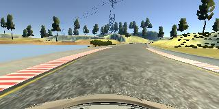

# **Behavioral Cloning** 

The goals / steps of this project are the following:
* Use the simulator to collect data of good driving behavior
* Build, a convolution neural network in Keras that predicts steering angles from images
* Train and validate the model with a training and validation set
* Test that the model successfully drives around track one without leaving the road
* Summarize the results with a written report

## Rubric Points
### Here I will consider the [rubric points](https://review.udacity.com/#!/rubrics/432/view) individually and describe how I addressed each point in my implementation.  

---
### Files Submitted & Code Quality

#### 1. Submission includes all required files and can be used to run the simulator in autonomous mode

My project includes the following files:
* model.py containing the script to create and train the model
* drive.py for driving the car in autonomous mode
* model.h5 containing a trained convolution neural network 
* writeup_report.md or writeup_report.pdf summarizing the results

#### 2. Submission includes functional code
Using the Udacity provided simulator and my drive.py file, the car can be driven autonomously around the track by executing 
```sh
python drive.py model.h5
```

#### 3. Submission code is usable and readable

The model.py file contains the code for training and saving the convolution neural network. The file shows the pipeline I used for training and validating the model, and it contains comments to explain how the code works.

### Model Architecture and Training Strategy

#### 1. An appropriate model architecture has been employed

Firstly, the input data is normalized in the model using a Keras lambda layer. After that, 50 upper rows and bottom 25 rows of pixels are cropped to get rid of unrelated pixels (e.g. sky) to make the model easier to converged. After that, my model consists of three 5x5 filter size convolution neural network with depths between 24 and 48, and two 3x3 filter size convolution neural network with depths of 64. There are one RELU layer after every convolution neural networks layer to introduce nonlinearity. Two dropout layers of 0.5 dropout rate are included at the last 2 convolution neural networks to avoid over-fitting. After that, all feature map are flattened into one dimension for 4 fully connected layers with depth between 100 and 1. 

```python
model = Sequential()
model.add(Lambda(lambda x: x / 255 - 0.5, input_shape=(160, 320, 3)))
model.add(Cropping2D(cropping=((50, 25),(0, 0))))
model.add(Convolution2D(24, (5, 5), strides=2, activation='relu'))
model.add(Convolution2D(36, (5, 5), strides=2, activation='relu'))
model.add(Convolution2D(48, (5, 5), strides=1, activation='relu'))
model.add(Convolution2D(64, (3, 3), strides=1, activation='relu'))
model.add(Convolution2D(64, (3, 3), strides=1, activation='relu'))
model.add(Flatten())
model.add(Dense(100))
model.add(Dense(50))
model.add(Dense(10))
model.add(Dense(1))
```

#### 2. Attempts to reduce overfitting in the model

The model was trained and validated on different data sets to ensure that the model was not overfitting. 

However, model is still overfitting after around 10 epochs, thus, dropout layers are added in order to reduce overfitting.

#### 3. Model parameter tuning

The model used an adam optimizer, so the learning rate was not tuned manually (model.py line 94).

#### 4. Appropriate training data

Training data was chosen to keep the vehicle driving on the road. I used a combination of: 

- 2 x Center lane driving
- 1 x Reverse center lane diving
- 1 x Recovering from the left and right sides

For details about how I created the training data, see the next section. 

### Model Architecture and Training Strategy

#### 1. Solution Design Approach

The overall strategy for deriving a model architecture was to learn the lane line patterns and their corresponding steering commands.

My first step was to use a convolution neural network model similar to the model that was used in NVIDIA 'End to End Learning for Self Driving Cars' project. I thought this model might be appropriate because they are well tested on a highly similar problem.

**First challenge: overfitting**

**Dropout**

In order to gauge how well the model was working, I split my image and steering angle data into a training and validation set. I found that my first model had a low mean squared error on the training set but a high mean squared error on the validation set. This implied that the model was overfitting. 

To combat the overfitting, I added two layers of dropout with 0.5 dropout rate which make the model can be trained over more epochs.

**Early Stopping**

Then I realized the model usually converge very early and does not learn after 10 epochs, so I added an early stopping method to auto-stop the training if the validation loss is not decreasing for 7 epochs (model.py line 96), this enables me not to fine tune the total epoch manually. By saving the model that has the lowest validation loss, I also can ensure the best model is saved instead of the latest model that might not performs as good as the previous model.

**Second challenge: shape turns**

The final step was to run the simulator to see how well the car was driving around track one. 

There were a few spots where the vehicle fell off the track, especially the sharp turns. To improve the driving behavior in these sharp turns, I ignore the data that associate with steering command which have a magnitude of lower than 0.0001. This enable the data distribution to be more even spread across steering command value, thus making the model to be able to predict a more aggressive steering command for sharp turns.

At the end of the process, the vehicle is able to drive autonomously around the track without leaving the road.

#### 2. Final Model Architecture

The final model architecture (model.py lines 72-86) consisted of a convolution neural network with the following layers and layer sizes.

```python
model = Sequential()
model.add(Lambda(lambda x: x / 255 - 0.5, input_shape=(160, 320, 3)))
model.add(Cropping2D(cropping=((50, 25),(0, 0))))
model.add(Convolution2D(24, (5, 5), strides=2, activation='relu'))
model.add(Convolution2D(36, (5, 5), strides=2, activation='relu'))
model.add(Convolution2D(48, (5, 5), strides=1, activation='relu'))
model.add(Convolution2D(64, (3, 3), strides=1, activation='relu'))
model.add(Dropout(0.5))
model.add(Convolution2D(64, (3, 3), strides=1, activation='relu'))
model.add(Dropout(0.5))
model.add(Flatten())
model.add(Dense(100))
model.add(Dense(50))
model.add(Dense(10))
model.add(Dense(1))
```

#### 3. Creation of the Training Set & Training Process

To capture good driving behavior, I first recorded two laps on track one using center lane driving. 


I then recorded one laps on track one but with reverse direction. This will augment the dataset on one more track without creating a new track.


I then recorded the vehicle recovering from the left side and right sides of the road back to center so that the vehicle would learn to recover back if it is off track. 

|                                    |                                    |                                    |
| ---------------------------------- | ---------------------------------- | ---------------------------------- |
|  |  |  |


Then I repeated this process on track two in order to get more data points.

To augment the data sat, I also flipped images and angles horizontally (model.py line 45). This will ensure the model won't overfit to one steering direction because the track used to collect data is a close loop, there will be unbalance of right and left steering command.


After the collection process, I had around 9000 number of data points including both tracks. I then preprocessed this data by cropping out the upper 50 rows pixels and bottom 25 rows of pixels. After removing those small steering command data, I have only left with about 5000 data points, which make the training even faster and easy.


I finally randomly shuffled the data set and put 20% of the data into a validation set. 

I used this training data for training the model. The validation set helped determine if the model was over or under fitting or just fit. I used an adam optimizer so that manually training the learning rate wasn't necessary


Here is a plot of training loss and val loss:


#### 4. Final result

I am able to drive the vehicle 100% autonomously on both tracks. The video are included in the directory.

| Track 1 - Easy                       | Track 2 - Difficult                  |
| ------------------------------------ | ------------------------------------ |
|  |  |

## 