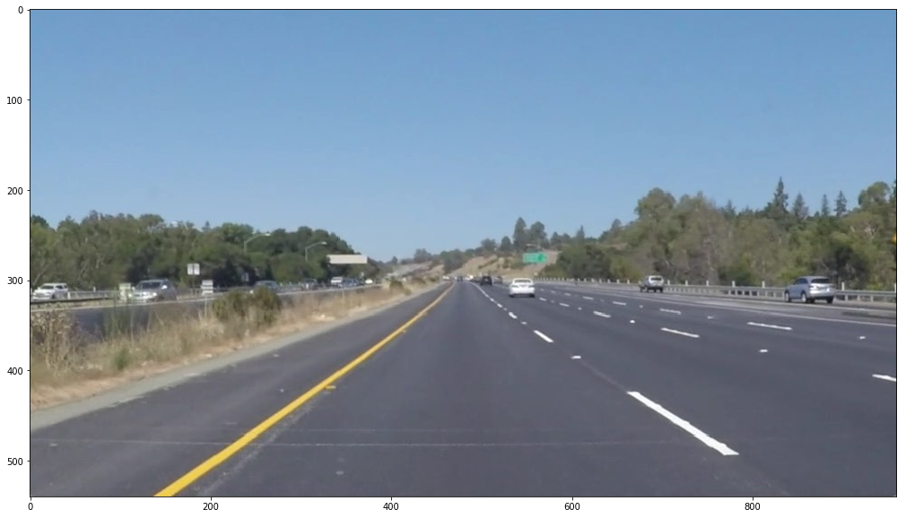
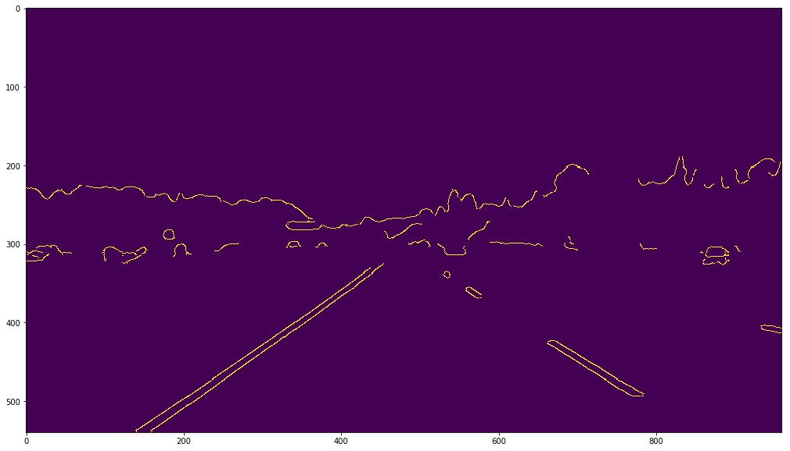
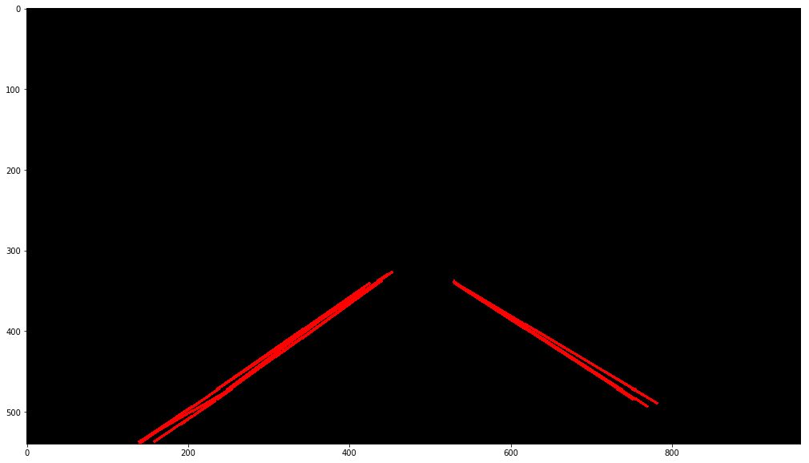
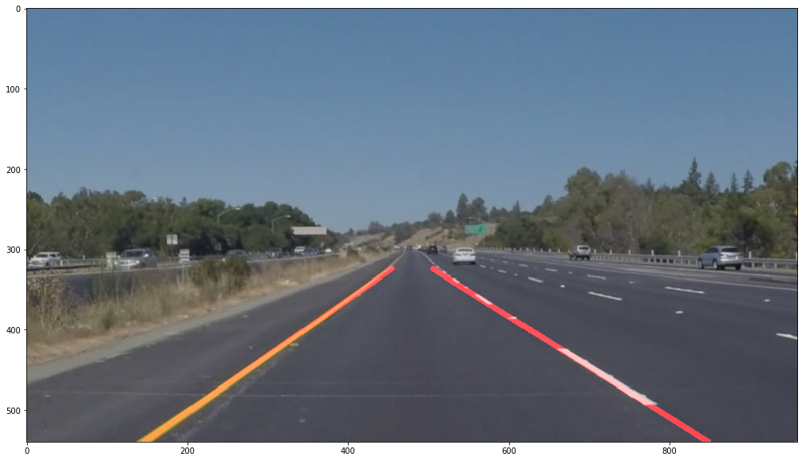

# **Finding Lane Lines on the Road** 

---

**Finding Lane Lines on the Road**

The goals / steps of this project are the following:
* Make a pipeline that finds lane lines on the road
* Reflect on my work in a written report

---

### Reflection

### 1. Pipeline.

**Original image:**



My pipeline consisted of 5 steps. First, I converted the images to **grayscale**, then I applied a **Gaussian blur** to exclude noises, then used **Canny edge detection** to detect edges in the whole image. 



After getting a nice edge image, I applied a mask to get my **region of interest** (ROI) to detect lane lines. After that, I used a well-tuned **Hough Lines** detector to get line segments based on the edge image. 



However, line segments are still not useful for self driving behavior because they are not continuous, and there are multiple lines corresponds to a single lane line. Therefore, in order to draw a single line on the left and right lanes, I modified the draw_lines() function by **classifying line segments** into segments for left lane, right lane and not used lane. Then, I **fitted those line segments** into a single lane line using `numpy.polyfit()` function and **extrapolated** the line to the furthest and nearest extends of the road. The code is written as follow:

```python
def draw_lines(img, lines, color=[255, 0, 0], thickness=2):
    xsize = img.shape[1]
    ysize = img.shape[0]
    ytop = int(ysize * 0.6)
    ybtm = ysize
    x_left = []
    x_right = []
    y_left = []
    y_right = []
    for line in lines:
        for x1,y1,x2,y2 in line:
            slope = (y2-y1)/(x2-x1)
            if slope > 0.5: # Points on left line
                x_left.append(x1)
                x_left.append(x2)
                y_left.append(y1)
                y_left.append(y2)
            elif slope < -0.5: # Points on right line
                x_right.append(x1)
                x_right.append(x2)
                y_right.append(y1)
                y_right.append(y2)
                
    if len(x_left) > 1 and len(y_left)  > 1: 
        left_line_fit = np.polyfit(x_left, y_left, 1)
        left_top = int((ytop - left_line_fit[1])/left_line_fit[0])
        left_btm = int((ybtm - left_line_fit[1])/left_line_fit[0])
        cv2.line(img, (left_top, ytop), (left_btm, ybtm), color, thickness)
    if len(x_right) > 1 and len(y_right) > 1: 
        right_line_fit = np.polyfit(x_right, y_right, 1)
        right_top = int((ytop - right_line_fit[1])/right_line_fit[0])
        right_btm = int((ybtm - right_line_fit[1])/right_line_fit[0])
        cv2.line(img, (right_top, ytop), (right_btm, ybtm), color, thickness)
```

**Result:**



### 2. Result on test video

<video src="test_videos_output/solidWhiteRight.mp4"></video>

### 3. Identify potential shortcomings with current pipeline

1. One potential shortcoming would be **inaccurate representation lane detection when the lane lines are curved**, because my current pipeline only model the lane lines into single straight line, which is not possible to represent road curved accurately.

2. Another shortcoming could be **false negative detection when the image is too bright/dark which makes the edges become insignificant**. The edges are too difficult to be detected when the pixel gradient value is not high, it is even more difficult when the Gaussian blur is applied on image for noise reduction. A similar failure is happen in the challenge video when the old road color is faded.
3. **Detection is noisy over image sequence** because the detection algorithm is not highly accurate to pixel level.


### 4. Possible improvements to current pipeline

1. A possible improvement would be to **fit the line segments into an arc line** to overcome the curve lane lines detection.

2. Another potential improvement could be to **normalize the RGB image** before converting it into grayscale image. This will significantly improve the performance during light invariance situation.
3. Another potential improvement could be to **track the detections over image sequence**. By tracking the line slope value using Kalman Filter, the detection will be much more stable over image sequence.