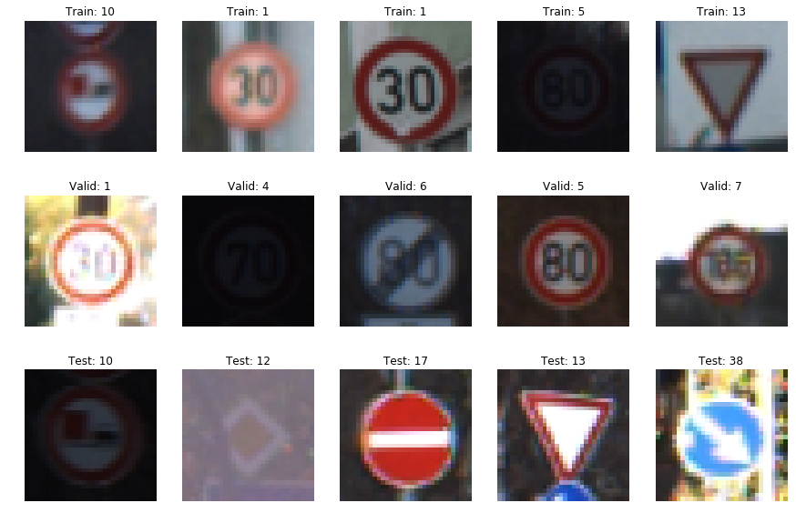
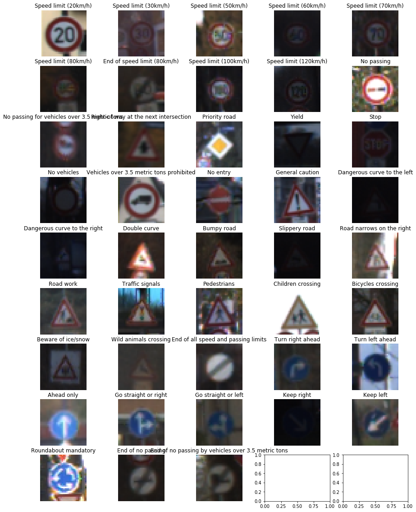
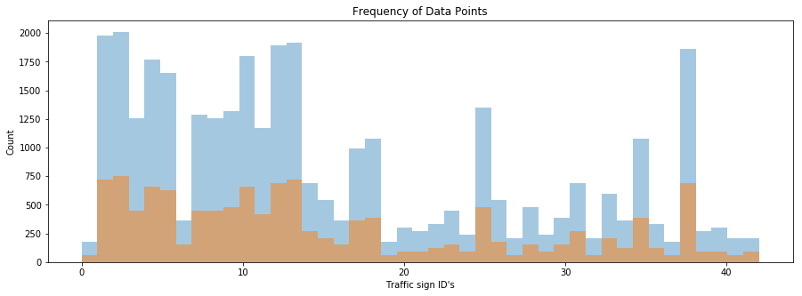
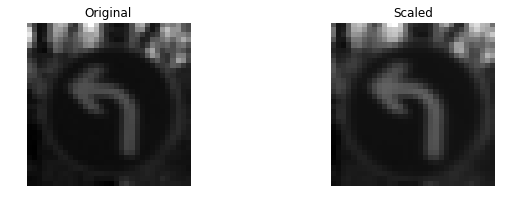
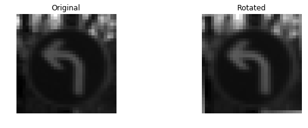
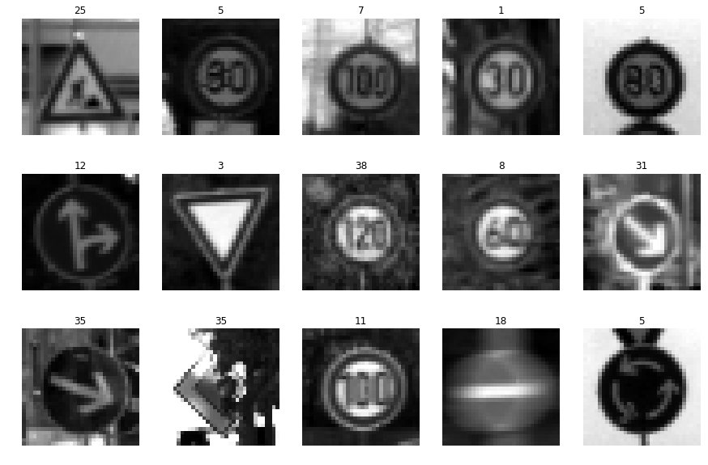
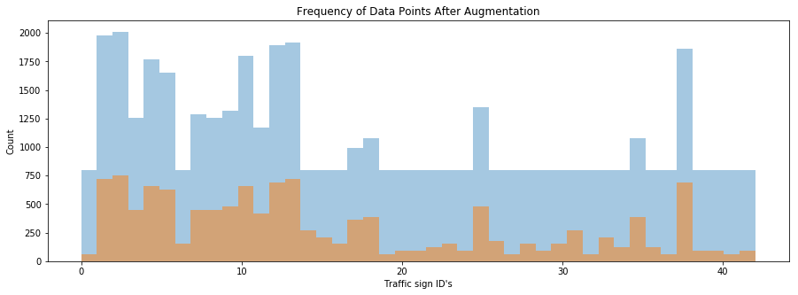
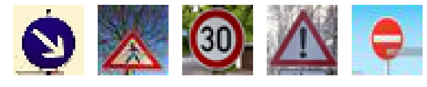

# **Traffic Sign Recognition** 

## Writeup

**Build a Traffic Sign Recognition Project**

The goals / steps of this project are the following:
* Load the data set (see below for links to the project data set)
* Explore, summarize and visualize the data set
* Design, train and test a model architecture
* Use the model to make predictions on new images
* Analyze the softmax probabilities of the new images
* Summarize the results with a written report

---
### Writeup / README

### Data Set Summary & Exploration

#### 1. Summary

I used the numpy library to calculate summary statistics of the traffic
signs data set:

* The size of training set is 34799
* The size of the validation set is 4410
* The size of test set is 12630
* The shape of a traffic sign image is (32, 32, 3)
* The number of unique classes/labels in the data set is 43

#### 2. Include an exploratory visualization of the dataset.

Here is a simple visualization of some random images from dataset. First row is train dataset, second row is validation dataset and third row is test dataset. You can see some of the images are too dark and some are too bright, but the imaeg quality and distribution is about the same across three split dataset.

Here is a visualization of image from every classes, total are 43 classes.

Here is a bar chart showing how the dataset class distribution is:

You can see from the histogram, the data distribution is very biased towards some of the classes. Some classes has around 2000 train images, but some is as little as 200. 

### Design and Test a Model Architecture

#### 1.1 Pre-processing and augmentation

**Grayscale**

As a first step, I decided to convert the images to grayscale in order to make the model less prune for overfitting and easier to converge.

**Normalization:**

As a last step, I normalized the image data to make the optimizer to converge faster, I have applied dataset normalization.

#### 1.2 Data augmentation

Since the data distribution is not evenly spread throughout all 43 classes. Therefore, I have decided to do some data augmentation for the classes that has less than 800 train images.

For each augmented data, I applied all three operations in this order: 

- Random scale

  

- Random rotate

  

- Random translate

  

Here are some of the data after pre-processing and augmentation:

Here is a bar chart showing how the dataset class distribution is after data augmentation, the classes that has less than 800 data points now has 800 data points. This make the distribution more even throughout all 43 classes.

#### 2. Describe what your final model architecture looks like including model type, layers, layer sizes, connectivity, etc.) Consider including a diagram and/or table describing the final model.

My final model consisted of the following layers:

| Layer         		|     Description	        					|
|:---------------------:|:---------------------------------------------:|
| Input         		| 32x32x1 Grayscale image |
| Convolution 3x3     	| 1x1 stride, valid padding, outputs 28x28x6 |
| RELU					| activation function |
| Dropout	| keep neural with 0.7 probability during training |
| Max pooling	      	| 2x2 stride, valid padding, outputs 14x14x6 |
| Convolution 3x3	    | 2x2 stride, valid padding, outputs 10x10x16 |
| RELU	| non-linear activation function |
|        Dropout        | keep neural with 0.7 probability during training |
|      Max pooling      |           2x2 stride,  outputs 5x5x16            |
|        Flatten        |    Flatten into 1 dimensionality, outputs 400    |
|    Fully connected    |                   outputs 120                    |
| RELU | non-linear activation function |
| Fully connected | outputs 84 |
| RELU | non-linear activation function |
| Fully connected | outputs 43 |
| Softmax cross entropy | outputs 'error' for the prediction |

#### 3. Training 

To train the model, I used an Adam optimizer because it can handle the learning rate dynamically. Moreover, I keep learning rate at 0.001 and batch size at 128. My dropout keep prob is at 0.7. Since I have already implemented dropouts, my model can afford to train for longer, so I train the model over 40 epochs.

#### 4. Approach taken for finding a solution

My final model results were:
* training set accuracy of 99.8%
* validation set accuracy of 93.6%
* test set accuracy of 92.1%

I have been using LeNet-5 architecture to train the dataset with original RGB dataset with just normalization, however, the test accuracy was around 70%. 

After converting data into grayscale, the test accuracy increase significantly to around 85%.

The train accuracy is already at 99%, so it is obviously the model is overfitting the dataset. Therefore I started implementing dropouts with 0.5 keep_prob, and train from 20 epochs to 40 epochs. But the validation and test accuracy is still at 90%.

After data augmentation such as random rotation, random scale and random translate, are applied, the validation and test accuracy increase until 91%.

After tuning the batch size from 64 to 128, my validation accuracy finally reaches 93% and test accuracy reaches 92%.

### Test a Model on New Images

#### 1. Possible challenges due to image quality

Here are five German traffic signs that I found on the web:

The second and fifth images might be difficult to classify because they were compressed therefore the aspect ratio might be different from the training dataset images.

#### 2. Discussion

Here are the results of the prediction:

| Image			        |     Prediction	        					|
|:---------------------:|:---------------------------------------------:|
| Keep right | Keep right  |
| Pedestrians | Pedestrians |
| Speed limit (30km/h)	| Speed limit (30km/h)	|
| General caution	| General caution	|
| No entry	| No entry     |

The model was able to correctly guess 5 of the 5 traffic signs, which gives an accuracy of 100%. This compares favorably to the accuracy on the test set of 92.1%.

Accuracy of 100% is not possible, but here I have got it. It is because my sample size is too smalll and coincidently the image quality of the five test images I found on web are all comparatively easy.

#### 3. Top 5 softmax probabilities

For the first image, the model is relatively sure that this is a `Keep right` sign (probability of 0.6), and the image does contain a `Keep right` sign. The top five soft max probabilities were

| Probability         	|     Prediction	        					|
|:---------------------:|:---------------------------------------------:|
| 1.00        | Keep right   |
| .00    | Turn left ahead |
| .00		| Roundabout mandatory	|
| .00	      | Slippery road	|
| .00				 | Speed limit (20km/h) |

For the second image, the model is relatively sure that this is a `Pedestrians` sign (probability of 0.6), and the image does contain a `Pedestrians` sign. The top five soft max probabilities were

| Probability |              Prediction               |
| :---------: | :-----------------------------------: |
|     .87     |              Pedestrians              |
|     .06     |            General caution            |
|     .06     |            Traffic signals            |
|    .001     |       Road narrows on the right       |
|    .0001    | Right-of-way at the next intersection |

For the third image, the model is relatively sure that this is a `Speed limit (30km/h)` sign (probability of 0.6), and the image does contain a `Speed limit (30km/h)` sign. The top five soft max probabilities were

| Probability |      Prediction      |
| :---------: | :------------------: |
|     .99     | Speed limit (30km/h) |
|    .0001    | Speed limit (20km/h) |
|     .00     |      Keep left       |
|     .00     | Speed limit (50km/h) |
|     .00     | Roundabout mandatory |

For the fourth image, the model is relatively sure that this is a `General caution` sign (probability of 0.6), and the image does contain a `General caution` sign. The top five soft max probabilities were

| Probability |        Prediction         |
| :---------: | :-----------------------: |
|    1.00     |      General caution      |
|     .00     |        Pedestrians        |
|     .00     |      Traffic signals      |
|     .00     | Road narrows on the right |
|     .00     |        Bumpy road         |

For the fiffth image, the model is relatively sure that this is a `No entry` sign (probability of 0.6), and the image does contain a `No entry` sign. The top five soft max probabilities were

| Probability |                  Prediction                  |
| :---------: | :------------------------------------------: |
|     .60     |                   No entry                   |
|     .20     |             Roundabout mandatory             |
|     .05     | No passing for vehicles over 3.5 metric tons |
|     .04     |               Turn left ahead                |
|     .01     |                  No passing                  |